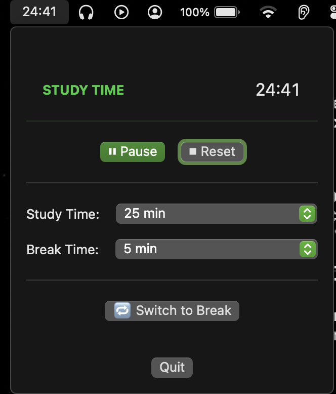

# Pomodoro Timer for macOS

A minimalist menu bar Pomodoro timer built with Swift and SwiftUI for macOS. Stay focused with customizable study and break sessions, all accessible from your menu bar.


<br><br>


## Features

- 🎯 **Menu Bar Integration** - Lives in your menu bar, no Dock icon clutter
- ⏱️ **Customizable Timers** - Set your own study (15-45 min) and break times (1-15 min)
- 🔔 **Notifications** - Get notified when it's time to study or take a break
- 🔊 **Sound Alerts** - Bell sound plays when switching between modes
- 🎨 **Clean Interface** - Simple, distraction-free design
- 🚀 **Lightweight** - Minimal resource usage, stays out of your way

## Requirements

- macOS 13.0 (Ventura) or later
- Xcode 14.0 or later (for building from source)

## Installation

### From Source

1. Clone this repository:
```bash
git clone https://github.com/sigmacoy/PomodoroTimer
```

2. Open the project in Xcode:
```bash
open PomodoroTimer.xcodeproj
```

3. Build and run the project (Cmd + R)

### Setting Up the Bell Sound

1. Add your `bell.mp3` (or `bell.MP3`) file to the project
2. Make sure it's added to the app target
3. The timer will play this sound when switching between study and break modes

## Usage

1. **Launch the app** - It will appear in your menu bar with the time remaining
2. **Click the menu bar icon** to open the control panel
3. **Start/Pause** - Use the ▶️ Start or ⏸ Pause button
4. **Customize timers** - Select your preferred study and break durations
5. **Switch modes manually** - Use the 🔁 Switch button to change between study and break
6. **Reset** - Click ⏹ Reset to go back to the default study timer

### Timer Modes

- **Study Time** 📚 - Focus time (default: 25 minutes, green indicator)
- **Break Time** ☕ - Rest time (default: 5 minutes, blue indicator)

The timer automatically switches between modes and sends a notification when each session ends.

## Technical Details

Built with:
- **Swift 5.9+**
- **SwiftUI** - Modern declarative UI framework
- **Combine** - Reactive timer management
- **UserNotifications** - macOS notification system
- **AVFoundation** - Audio playback for alerts
- **AppKit** - Menu bar integration

## Configuration

The app is configured to:
- Hide from the Dock (`LSUIElement` = true)
- Run as a menu bar accessory app
- Request notification permissions on first launch
- Stay hidden even when notifications are clicked

## Known Issues

- Notification permission must be granted for alerts to work
- Sound file must be named exactly `bell.mp3` or `bell.MP3`

## Contributing

Contributions are welcome! Feel free to:
- Report bugs
- Suggest new features
- Submit pull requests
